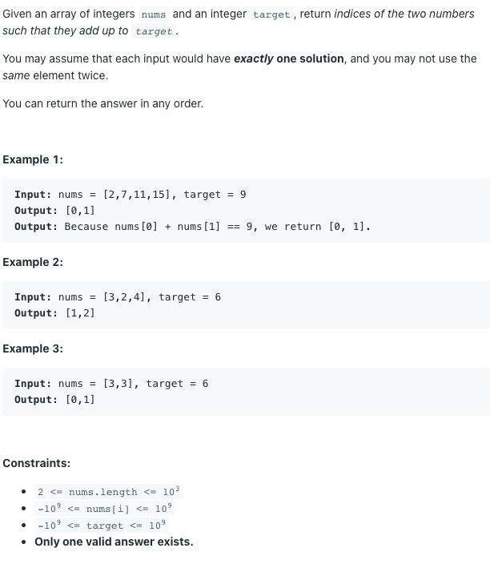

# 두 수의 합




## 풀이1) 브루트포스

시간복잡도 `O(n^2) `브루트포스 풀이로도 충분히 풀리는 문제다.

```python
for i in range(len(nums)):
    for j in range(i + 1, len(nums)):
        if nums[i] + nums[j] == target:
            return [i, j]
```

## 풀이2) 해쉬 맵 활용하기

- i가 0부터 len(nums) - 1까지 다음을 반복한다.
  - target - nums[i]가 해쉬 맵의 키로 존재하는지 찾는다.
    - 존재한다면 그 값을 꺼내고 i와 함께 반환한다.
  - i번째 수의 값과 인덱스를 각각 해쉬 맵의 키, 값으로 넣는다.

```python
dict = {}
for i in range(len(nums)):
    rest = target - nums[i]
    if rest in dict:
        return [dict[rest], i]
    dict[nums[i]] = i
```


## 번외 풀이) 투 포인터

만약

- 문제에서 주어진 배열이 정렬된 상태라면
- 또는 두 수의 인덱스가 아니라 값만 출력하면 된다면

투 포인터를 사용하여 `O(n)`으로 풀 수도 있다.


문제를 조금 바꿔 배열이 항상 정렬된 상태라고 해보자.

배열의 왼쪽 끝과 오른쪽 끝에 각각 포인터를 잡는다.

만약 현재 포인터 위치에 있는 값들의 합이...

- target 보다 작다면 왼쪽 포인터를 오른쪽으로 한 번 이동시킨다.
- target 보다 크다면 오른쪽 포인터를 왼쪽으로 한 번 이동시킨다.
- target과 같다면 현재 포인터 위치를 반환한다.
- 왼쪽 포인터와 오른쪽 포인터가 만나기 전까지 반복한다.

```python
left = 0
right = len(nums) - 1

while left < right:
    sum = nums[left] + nums[right]
    
    if sum > target:
        right -= 1
    elif sum < target:
        left += 1
    else:
        return [left, right]
```

