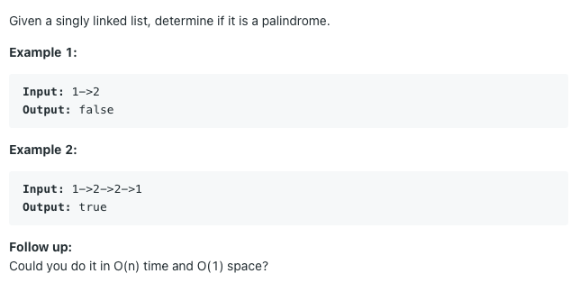

# 팰린드롬 연결 리스트

# 

## 풀이1) 연결 리스트를 배열로 변환해서 풀기

시간복잡도: `O(n)`

공간복잡도: `O(n)`

```python
li = []
while head:
    li.append(head.val)
    head = head.next        

return li == li[::-1]
```

연결 리스트를 배열로 바꾸면 팰린드롬인지 검사하는 것이 매우 쉬워진다. 

하지만 이 경우 공간복잡도를 `O(n)` 을 쓰게 되는데 문제에 나와있는 것 처럼 `O(1)` 만에 풀려면 다른 방법이 필요하다.


## 풀이2) 런너 알고리즘 활용

런너 알고리즘은 연결 리스트의 중간 지점을 찾게 해주는 알고리즘이다.

두 개의 포인터를 연결 리스트의 시작지점에서 같이 시작하여 하나는 한 번에 두 칸씩 이동하고, 하나는 한 번에 한 칸씩 이동하면 빠른 포인터가 연결 리스트의 끝에 도달했을 때 느린 포인터는 연결 리스트의 중간 지점까지 오게된다.

우선은 런너 알고리즘을 활용하여 주어진 연결 리스트의 중간 지점까지 연결 방향을 바꾼다, 

예를 들어 원래 연결 리스트가 다음과 같이 주어졌다면

```
1 -> 2 -> 3 -> 3 -> 2 -> 1
```

이를 다음과 같이 바꾼다.

```
1 <- 2 <- 3  3 -> 2 -> 1
```

그 다음엔 왼쪽 연결 리스트와 오른쪽 연결 리스트가 같은지를 하나씩 이동하면서 확인하고, 끝까지 같았다면 이 연결 리스트는 팰린드롬이다.

단 연결 리스트의 길이가 홀수라면 주의해줘야 한다.

```
1 <- 2 <- 3  4 -> 3 -> 2 -> 1
```

이렇게 왼쪽과 오른쪽 연결 리스트의 길이가 같지 않기 때문에 두 연결 리스트를 비교하기 전에 오른쪽 연결 리스트를 한 칸 더 움직여줘야 한다.

```python
class Solution:
    def isPalindrome(self, head: ListNode) -> bool:
        slow = fast = head
        
        prev = None
        while fast and fast.next:
            fast = fast.next.next
            
            nxt = slow.next
            slow.next = prev
            prev = slow
            slow = nxt
        
        if fast:
            slow = slow.next
        
        while prev and slow and prev.val == slow.val:
            prev = prev.next
            slow = slow.next
        
        if prev:
            return False
        
        return True
        
```

