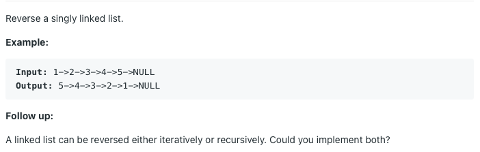

# 역순 연결 리스트



## 풀이1) 반복문 사용

우선 `prev = None` 으로 초기화한다.

- 현재 head의 next를 prev로 바꾼다.

- prev를 head로 옮긴다.

- head를 head의 원래 next로 옮긴다.
  - 주의: 위에서 head의 next를 prev로 바꿨다는 사실을 기억해야 한다. `head = head.next` 라 하면 오동작한다. 따라서 head의 next를 prev로 바꾸기 전에 원래 next를 따로 저장해야 한다.

위 단계를 head가 None이 될 때까지 반복한다.


```python
prev = None
while head:
    nxt = head.next
    head.next = prev
    prev = head
    head = nxt

return prev
```

파이썬의 다중 할당을 이용하면 nxt 변수를 만들지 않고 한 줄로 처리할 수 있다.


```python
while head:
    head.next, prev, head = prev, head, head.next
```

