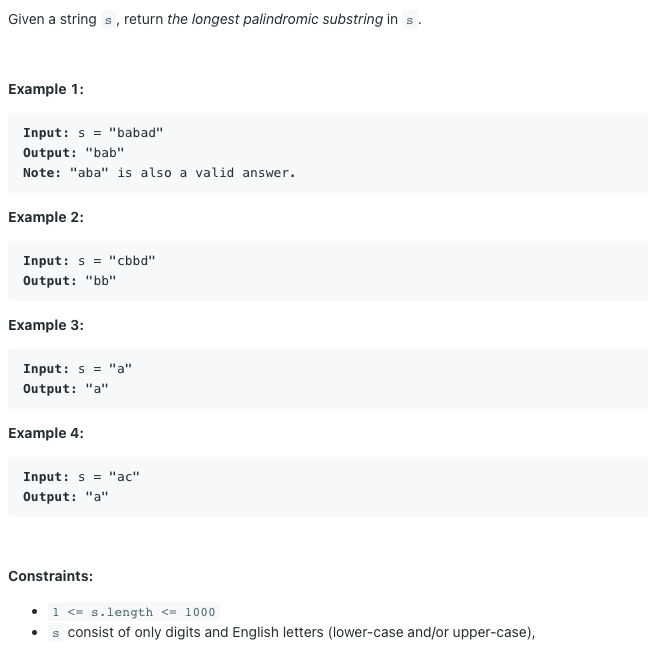
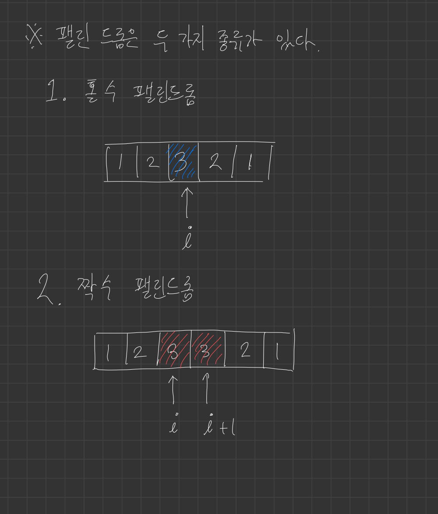

# 가장 긴 팰린드롬 부분 문자열

## 

## 풀이1) 브루트포스

부분 문자열의 수 = `O(n^2)`

부분 문자열이 팰린드롬인지 확인 = `O(n)`

전체 시간복잡도 = `O(n^3)`

n이 최대 1000이므로 브루트포스로는 풀 수 없다.


## 풀이2) 중심에서 확장하기

중심을 정하는 수 = `O(n)`

그 중심에서 가장 긴 팰린드롬 구하기 = `O(n)`

전체 시간복잡도 = `O(n^2)`



### 의사 코드

```
최장_부분_팰린드롬 = ""
for i = 0 to len(s):
    홀수_팰린드롬 = 중심이 (i, i)인 가장 긴 팰린드롬
    짝수_팰린드롬 = 중심이 (i, i+1)인 가장 긴 팰린드롬
    최장_부분_팰린드롬 = 최장_부분_홀수_팰린드롬, 홀수_팰린드롬, 짝수_팰린드롬 중 가장 긴 문자열
    
return 최장_부분_팰린드롬
```

중심이 (i, j)인 가장 긴 팰린드롬을 찾는 코드는 다음과 같다.

```
while i >= 0 and j < len(s) and s[i] == s[j]:
    i -= 1
    j += 1
    
return s[i+1:j]
```

### 파이썬 코드

```python
class Solution:
    def expand(self, s, i, j):
        while i >= 0 and j < len(s) and s[i] == s[j]:
            i -= 1
            j += 1

        return s[i+1:j]

    def longestPalindrome(self, s: str) -> str:
        ans = ""

        for i in range(len(s)):
            ans = max(
                ans,
                self.expand(s, i, i),
                self.expand(s, i, i + 1),
                key=len
            )

        return ans
```