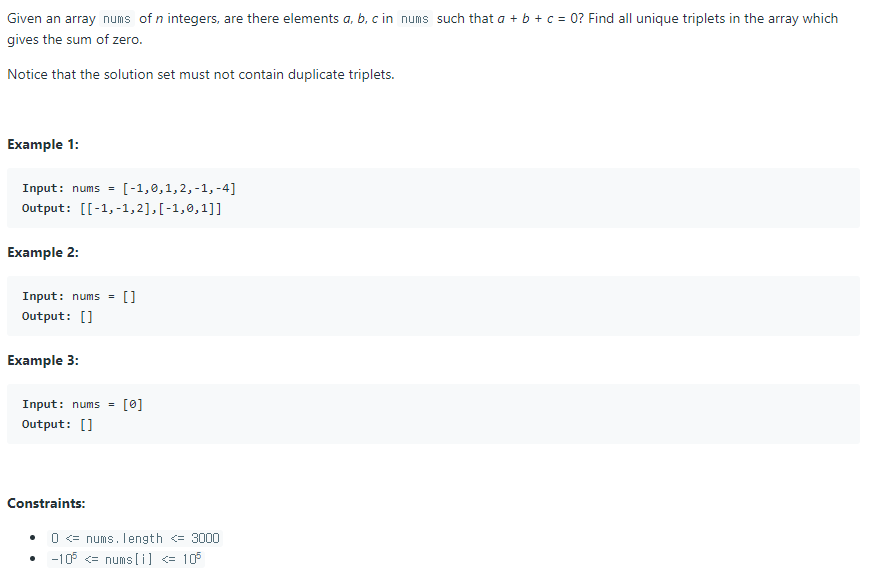

# 세 수의 합



## 풀이1) 브루트포스

세 수의 조합 구하기 = `O(n^3)`

세 수의 합이 0인지 판단하기 = `O(1)`

전체 시간 복잡도는 `O(n^3)` 이므로 시간초과가 날 것이다.


## 풀이2) 투 포인터 활용

`a + b + c = 0` 인 a, b, c를 찾는 문제를 

1. a를 고르기
2. `b + c = -a`인 b, c를 찾기

로 나눌 수 있다.

a를 고르는 방법의 수는 `O(n)`이고, `b + c = -a`인 b, c를 찾는 것은 `투 포인터`를 사용하면 `O(n)`만에 가능하다. ([두 수의 합](../2/README.md) 문제 참고)

따라서 전체 시간 복잡도는 `O(n^2)`이다.

투 포인터를 사용하려면 먼저 배열을 정렬시켜야 한다.

또한 이 문제는 nums 배열의 요소들은 중복될 수도 있으므로 세 수 조합의 중복을 제거하는 데에 신경을 써야한다.

```python
def threeSum(self, nums):
    nums.sort()
    
    ans = []
    for i in range(len(nums)):
        # 중복 피하기
        if i > 0 and nums[i] == nums[i - 1]:
            continue
            
        ans += self.twoSum(nums, i + 1, -nums[i])
        
    return ans
```

```python
def twoSum(self, nums, start, target):
    left = start
    right = len(nums) - 1
    
    while left < right:
        # 중복 피하기
        if left > start and nums[left] == nums[left - 1]:
            left += 1
            continue
        if right < len(nums) - 1 and nums[right] == nums[right + 1]:
            right += 1
            continue
        
        s = nums[left] + nums[right]

        twosums = []
        if s > target:
            right -= 1
        elif s < target:
            left += 1
        else:
            twosums.append([-target, nums[left], nums[right]])
            left += 1
            right -= 1
    
    return twosums
```

