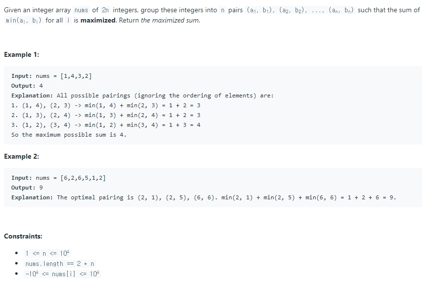

# 배열 파티션1




## 풀이1) 브루트포스

n개의 수를 두 개씩 짝을 이루어 묶는 방법의 수는 

`nC2 * (n-2)C2 * (n-4)C2 * .... * 2C2` = `n! / 2^(n/2)`이다.

n이 20이어도 `2*10^15` 이 넘어가니 시간 내에 풀 수 없다.

## 풀이2) 차이가 작은 수들로 묶기

두 개 쌍으로 묶은 결과를 

(a1, b1), (a2, b2), (a3, b3), ... ,(am, bm) 이라 하자. (ai < bi)

a1 + b1 + a2 + b2 + a3 + b3 + ... + am + bm = Sn은 항상 일정하다.

이 때 a1 + a2 + a3 + .... + am의 최댓값을 구해야 하는데

LOSS = (b1 - a1) + (b2 - a2) + (b3 - a2) + ... + (bm - am) 라고 하면

 Sn - LOSS = 2(a1 + a2 + a3 + ... + am) 이기 때문에

LOSS를 최소로 만들면 a1 + a2 + a3 + ... + am은 최대가 된다.

배열을 정렬하여 인접한 두 수 끼리 묶는다면 LOSS가 최소가 될 것이다.

```python
def arrayPairSum(self, nums: List[int]) -> int:
    nums.sort()
        
    sum = 0
    for num in nums[::2]:
        sum += num
        
    return sum
```

