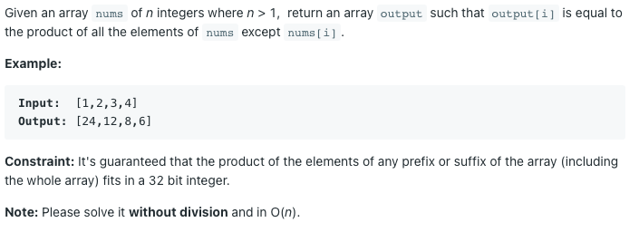

# 자신을 제외한 배열의 곱



## 풀이1) 

원래라면 전체 곱을 구하고 자기 자신을 나누는 방법으로 풀 수 있을텐데, 문제에서 나눗셈을 하지 않고 풀라 했으니 다른 방법을 찾아야 한다. 브루트포스는 `O(n^2)` 이니 가능하지 않다.

i번째 수를 제외한 배열의 곱은 다음과 같이 나타낼 수 있다.

```
0부터 i-1번째 수까지의 곱 * i+1부터 len(nums)-1번쨰 수까지의 곱
```

데이터를 전처리하여 왼쪽에서 곱해나간 값들과 오른쪽에서 곱해나간 값들을 저장해 놓는다면 i번째 수를 제외한 배열의 곱을 `O(1)` 만에 구할 수 있다.

```python
    def productExceptSelf(self, nums: List[int]) -> List[int]:
        left = [1]
        right = [1]
        
        for num in nums:
            left.append(left[-1] * num)
            
        for num in nums[::-1]:
            right.append(right[-1] * num) 
        right = right[::-1]
        
        ans = []
        for i in range(len(nums)):
            # left[i]: 0 ~ i-1 수들의 곱
            # right[i+1]: i+1 ~ len(nums)-1 수들의 곱 
            ans.append(left[i] * right[i + 1])
            
        return ans
```

전처리에 `O(n)` , 정답을 구하는 데 `O(n)` 이므로 전체 시간 복잡도는 `O(n)` 이다.