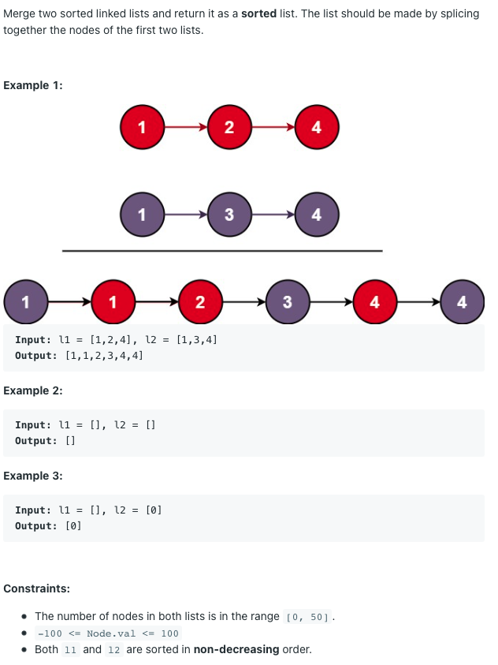

# 두 정렬 리스트의 병합



## 풀이1)

l1이 비어있지 않고, (l2가 비어있거나 l1.val < l2.val) 이면 l1에서 값을 꺼낸다.

l2가 비어있지 않고, (l1이 비어있거나 l1.val >= l2.val) 이면 l2에서 값을 꺼낸다.

이를 l1과 l2가 모두 빌 때까지 반복한다.


```python
ans = ans_head = ListNode()

while l1 or l2:
    if l1 and (not l2 or l1.val < l2.val):
        ans.next = ListNode(l1.val)
        l1 = l1.next
        ans = ans.next
    
    if l2 and (not l1 or l1.val >= l2.val):
        ans.next = ListNode(l2.val)
        l2 = l2.next
        ans = ans.next
        
return ans_head.next
```

사실 `while l1 or l2` 문 안에서 두 조건식은 서로 여집합 관계이므로 `if else` 문으로 바꿀 수 있다.


```python
while l1 or l2:
    if l1 and (not l2 or l1.val < l2.val):
        ans.next = ListNode(l1.val)
        l1 = l1.next
    
    else:
        ans.next = ListNode(l2.val)
        l2 = l2.next
		
    ans = ans.next
```

l1과 l2를 상황에 따라 바꿔 항상 한쪽에서만 값을 빼도록 하면 코드가 더 간단해진다.

```python
while l1 or l2:
    if l1 and (not l2 or l1.val < l2.val):
        l2, l1 = l1, l2
    
    ans.next = ListNode(l2.val)
    l2 = l2.next
    ans = ans.next
```

